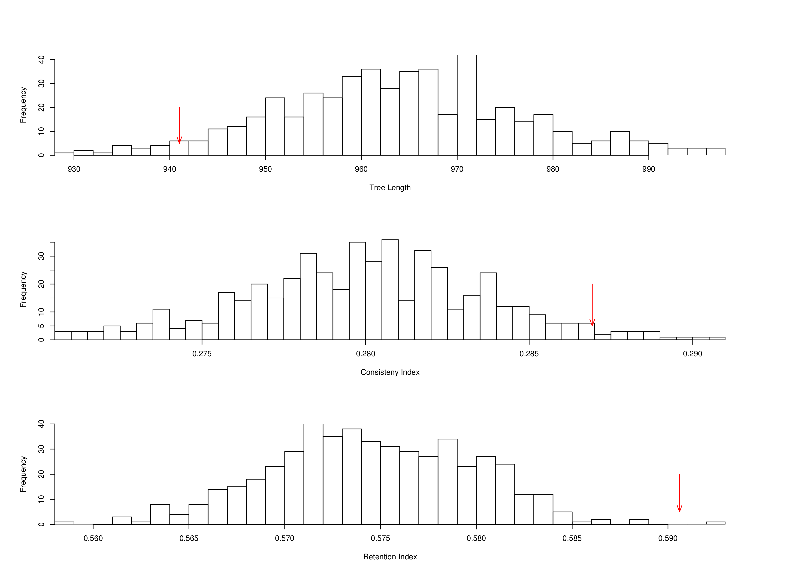

# Permute the order of ordered character states

## SCRIPT NAME

[`neworder.pl`](src/neworder.pl)

## VERSION

Documentation for `neworder.pl` version 0.1.0

## SYNOPSIS

    $ neworder.pl [options] INFILE

## DESCRIPTION

Script for creating a *NUMBER* of random permutations of character
orderings in Nexus file INFILE. If option *--paup* is used, the script
creates the files, and tries to run them using [paup](http://paup.phylosolutions.com/).

Note that *Ctype* needs to be present in the Paup block and written on a
single line. The script reads only a single Paup block (the first), and
any specific search arguments should be specified in the block.

Example of readable Nexus format:

    #NEXUS
    Begin data;
    Dimensions ntax=3 nchar=4;
    Format missing=? gap=- datatype=DNA;
    Matrix
    Apa 00(01)0
    Bpa 1111
    Cpa 2212
    ;
    End;
    Begin Paup;
    Outgroup Apa;
    Ctype ord : 1 2 4;
    Hsearch addseq=rand reps=10;
    End;

## OPTIONS

    -r, --reps=*NUMBER*
            Write *NUMBER* of permuted data sets to file. Default is 100.

    -p, --paup
            Try to run the created file in paup. --nopaup prevents this.
            Default is to not run paup.

    -w, --write-R
            Read scores file and write R file. Paup needs to have been run
            on the oufile created by the script.

    -o, --outfile=NAME
            Specify output file NAME. If --outfile is not used, a file
            starting with INFILE and ending in .bat will be created.

    -V, --VERBOSE
            Be verbose. Can also be --noVERBOSE (default).

    -h, --help
            Prints help message and exits.

    -v, --version
            Prints version message and exits.

    -m, --man
            Displays the manual page.

    INFILE  Nexus formatted data INFILE.

## USAGE

    $ neworder.pl --reps=*NUMBER* --[no]paup --write-R --outfile=OUTFILE --[no]VERBOSE INFILE

## AUTHOR

Written by Johan A. A. Nylander

## DEPENDENCIES

Perl.

Optional: [PAUP\*](http://paup.phylosolutions.com/).
Needs to be installed as 'paup' in the PATH.

## LICENSE AND COPYRIGHT

Copyright (c) 2007-2022 Johan Nylander

Permission is hereby granted, free of charge, to any person obtaining a copy
of this software and associated documentation files (the "Software"), to deal
in the Software without restriction, including without limitation the rights
to use, copy, modify, merge, publish, distribute, sublicense, and/or sell
copies of the Software, and to permit persons to whom the Software is
furnished to do so, subject to the following conditions:

The above copyright notice and this permission notice shall be included in all
copies or substantial portions of the Software.

THE SOFTWARE IS PROVIDED "AS IS", WITHOUT WARRANTY OF ANY KIND, EXPRESS OR
IMPLIED, INCLUDING BUT NOT LIMITED TO THE WARRANTIES OF MERCHANTABILITY,
FITNESS FOR A PARTICULAR PURPOSE AND NONINFRINGEMENT. IN NO EVENT SHALL THE
AUTHORS OR COPYRIGHT HOLDERS BE LIABLE FOR ANY CLAIM, DAMAGES OR OTHER
LIABILITY, WHETHER IN AN ACTION OF CONTRACT, TORT OR OTHERWISE, ARISING FROM,
OUT OF OR IN CONNECTION WITH THE SOFTWARE OR THE USE OR OTHER DEALINGS IN THE
SOFTWARE.
